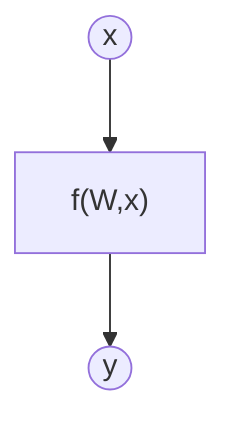
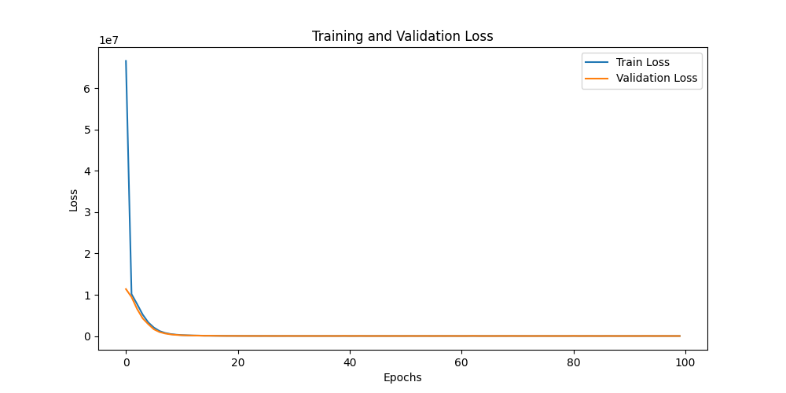
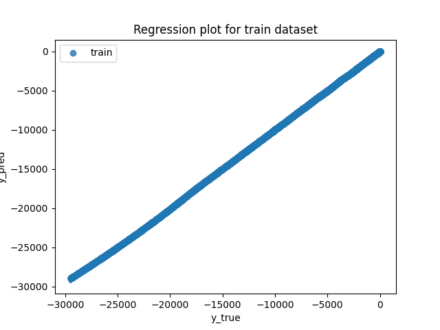
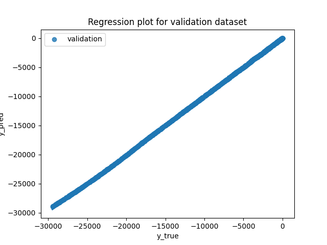
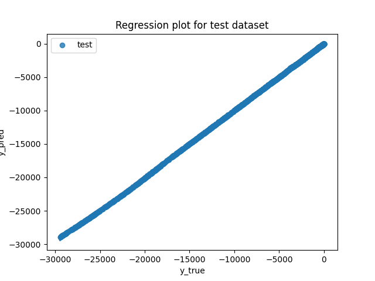
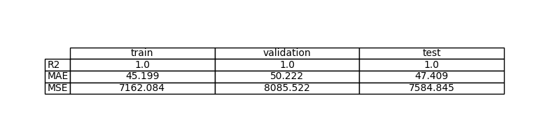
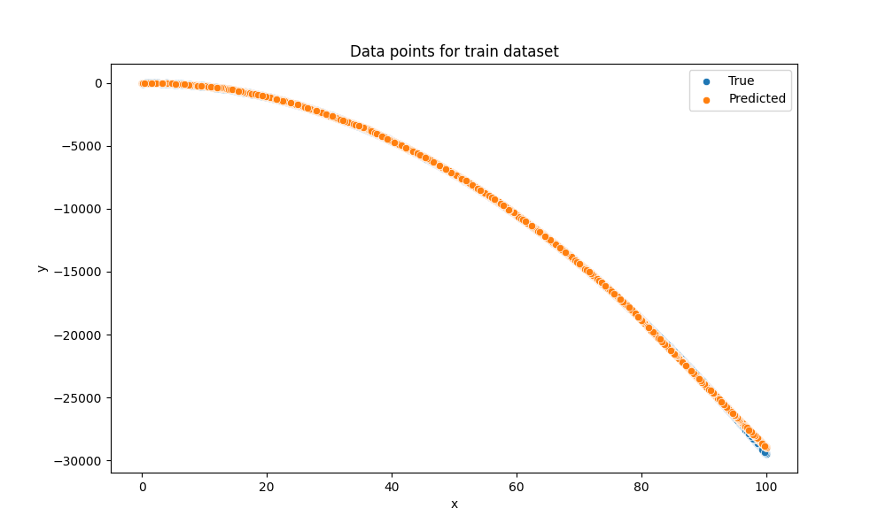
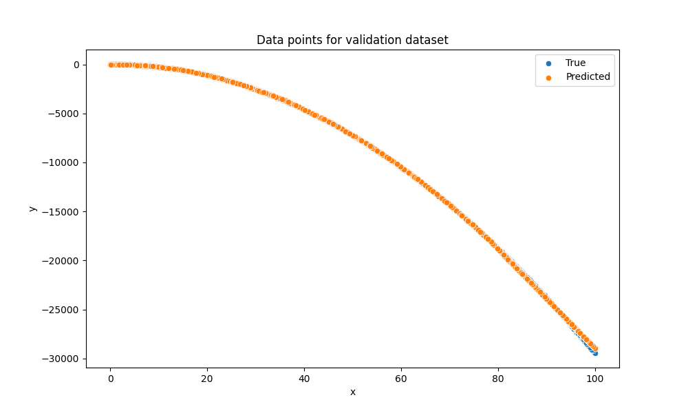

# Ejercicio 2: Aprender una función cuadrática

## Objectivo

Modelar la función cuadrática y = -3x^2 + 2x con PyTorch

## Formalización

The task in hand can be formalized in two steps. First, we will define what we are tring to achieve as clearlly as possible. Second, we will define the approach we are taking to solve it.

### Task Formalization (Inference)

There is an unknown function $f$ for which we have a bunch of data about certain input $x$ and its corresponding output $y$.

$$
y = f(x)
$$

We are trying to create a model of $f$ using a Machine Learning method to infer the $W$ weight matrix that better expreses the relationship between $x$-$y$ pair of data. Mathematically expressed:

$$
y = f(W,x)
$$

Graphically expressed:

```mermaid
graph TD
    A((x)) --> B["f(W,x)"]
    B --> C((y))
    
```
The input vector has size [bs x 1]. The weight matrix has size [1 x 1]

### Task Formalization (Training)

Al trabajar con una función cuadrática se ha decidido que la estructura de la red neuronal tiene que ser multicapa. Para ello, se ha seguido la estructura de la primera práctica, pero usando el modelo de un perceptrón multicapa en vez de uno simple.

## métricas de evaluación

Como se está trabajando con un problema de regresión, se va a usar una función de pérdida en forma de error cuadrático medio (MSE), error absoluto de media (MAE) y R-cuadrada como métricas de evaluación.

### Descripción del dataset

El dataset utilizado ha sido el mismo que el utilizado en la primera práctica: 100 puntos con ruido con una desviación estándar de 20% de la función real.

### Preparación y procesado de los datos

No se ha llevado a cabo ningún preprocesado en el dataset, solamente se ha dividido en entrenamiento, validación y testeo.

### Aumentación de los datos

No se ha aumentado el tamaño de los datos

## Consideraciones del modelo

Como ya se ha mencionado, al trabajar con una función cuadrática se ha optado por utilizar un modelo multicapa en vez de uno de capa simple.

### Funciones de pérdida validos

Las funciones de pérdida o coste a utilziar en un problema de clasificación son los que calculan cuantitativamente el error entre la respuesta estimada y la correcta. En este caso, error cuadrático medio, error absoluto de media y R cuadrada.

### Activación de última capa

Como es una tarea de regresión sin límites superiores ni inferiores, la activación de la última capa se deja en la función identidad.

En un principio hemos tenido un problema en el diseño del modelo porque habíamos puesto una relu después de la última capa, por lo que la salida de esa capa siempre salía nula, haciendo que el modelo no aprendiera nada con el entrenamiento. Posteriormente, hemos arreglado ese problema y ha hemos conseguido que el modelo funcione correctamente.

### Otras consideraciones

En relación al problema que se ha tenido por haber puesto una capa de activación relu a la salida de la última capa, se ha subido el learning rate hasta 0.1 porque porque no variaba el validation loss. La razón ha sido que había una capa relu que anulaba la salida. En cualquier caso, tras solucionar el problema y entrenar la red con ese learning rate, la respuesta estimada oscilaba mucho a diferencia de la la real. Por ello, se he bajado un poco más el learning rate hasta lr = 0.001. De esta forma se consigue que el modelo busque más en los mínimos locales que en los globales, obteniendo una salida mejor para este caso.

Por otro lado, se ha decidido poner 64 neuronas en la capa oculta y dos capas intermedias. Ha sido por lo mismo que al principio, que como había relu al final no cambiaba y hemos decidido poner otra capa oculta a ver si con eso cambiaba. Luego nos hemos dado cuenta de que no era ese el problema, pero hemos mantenido las dos capas ocultas. Quitando una de las capas se obtendría un valor mejor que un modelo de una única capa, pero peor que con dos.

### Hiperparámetros de entrenamiento

Como se ha mencionado, se ha impuesto un learning rate de 0.001, con el que la respuesta obtenida nos ha parecido correcta.

### Loss function graph

### Discussion of the training process

Write your answer here

## Evaluación

### Métricas de evaluación

Metrics for each dataset is depicted: 

### Evaluation results

Here you have examples of evaluation results for train, validation and test sets.

Example for train set:

Example for validation set:

Example for test set:

### Discussion of the results

How the model solves the problem?
Is there overfitting, underfitting or any other issues? 
How can we improve the model?
How this model will generalize to new data?

El modelo sigue correctamente con los datos predichos a la curva de los datos verdaderos, por lo que se puede decir que el modelo es correcto.

No es demasiado simple porque la parábola se sigue de forma correcta y porque no se ven errores.

Tampoco hay overfitting porque no se ven oscilaciones y las predicciones son suaves. No se considera que el modelo deba ser más complejo o más concreto, ya que resuelve el problema de forma correcta.

Si se utilizaran otros datos la respuesta sería de igual forma correcta. Si la función fuera algo más compleja, posiblemente harían falta más datos de entrenamiento, pero la arquitectura de la red puede mantenerse para solucionar este problema.

## Design Feedback loops

Describe the process you have followed to improve the model and the evolution of performance of the model during the process.

You can include a table stating the chanched parameters and the obtained results after the process.

## Questions

Pleaser answer the following questions. Include graphs if necessary. Store the graphs in the `outs/exercise_02` folder.

### Which are the differences you found between previous model and this one?

Una neurona puede responder a funciones del tipo

$$
y=w1\cdot​x1​+w2\cdot​x2​+⋯+b
$$

Es decir, combina las entradas linealmente. Con ese tipo de red simple se pueden obtener rectas o hiperplanos. Sin embargo, en este caso la función a obtener es cuadrática, una única capa no puede obtener ese modelo. Es por ello que, utilizando un modelo multicapa con neuronal ocultas, permite crear no linealidades en la salida, lo necesario para obtener el modelo de una función cuadrática.

### Does the model generalizes well to new data?

El modelo nuevo funciona correctamente por lo que se puede ver en las curvas predicción/respuesta y por los valores obtenidos en las funciones de pérdida.

