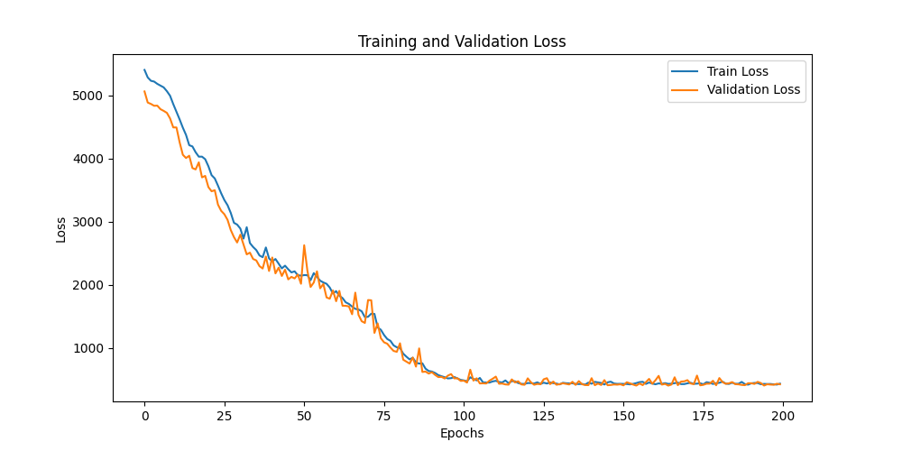
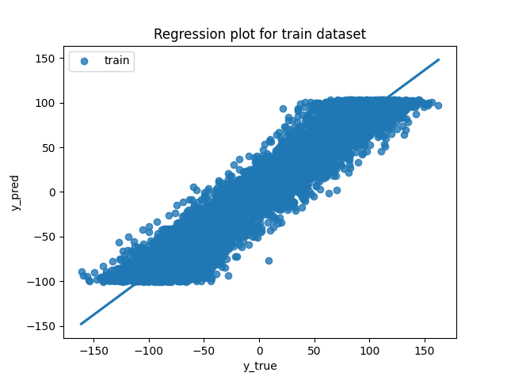
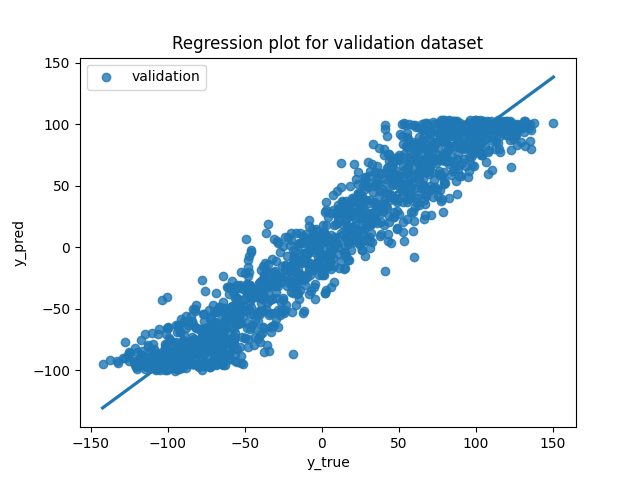
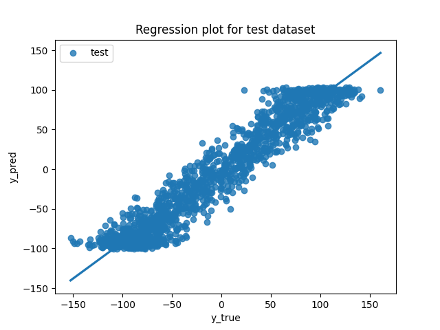
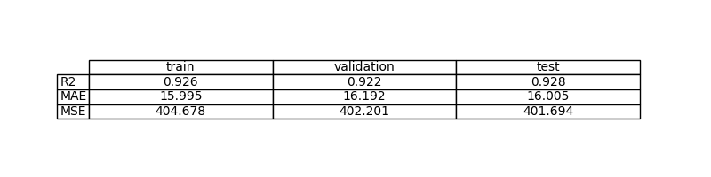
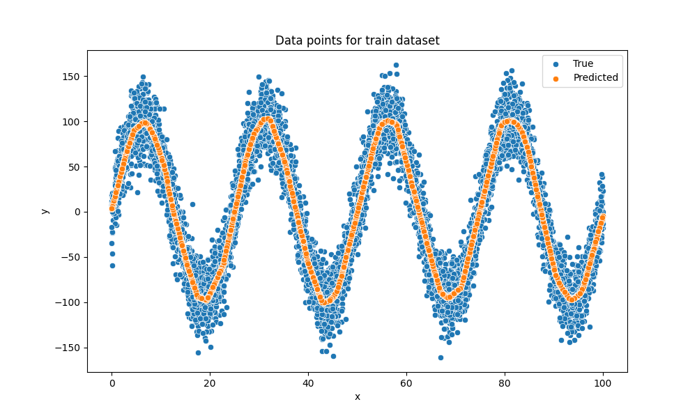
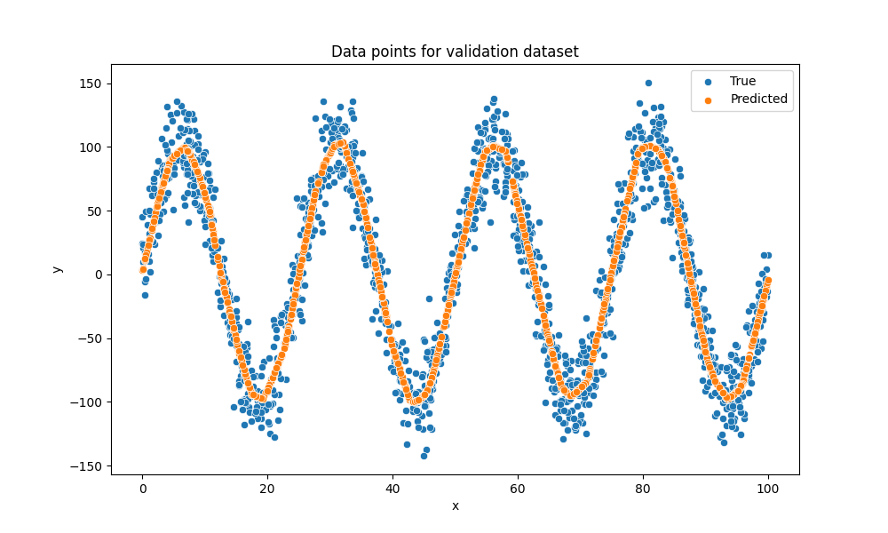
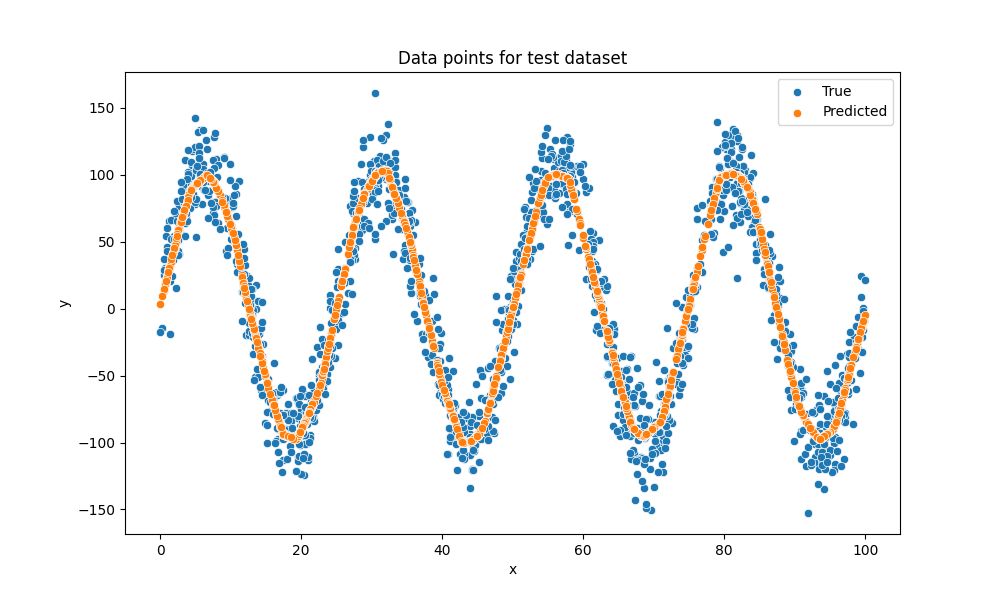

# Exercise 3: Learn a linear function with PyTorch

## Objective

Estimation of a unknown function by a machine learning model

## Data Considerations

### Dataset description

El dataset para el estudio se genera en el archivos dataset.py. A partor de una función senoidal con un ruido gaussiano se genera una señal que simularía cierto ruido.

### Data preparation and preprocessing

El entrenamiento se ha comenzado sin un preprocesado. Sin emabrgo, y como se explicará más adelante, ha sido necesario normalizar la entrada de datos para asegurar unos resultados de entrenamiento favorables. 

## Model Considerations

Para la optimización se hace uso de una MultiLayer Perceptron (MLP), definida en el archivo model.py

### Selected Loss Function

La función de pérdida definida es la correspondiente al error cuadrático medio (MSE) al tratarse de un problema clásico de regresión.

### Possible architectures

MLP compuesta de capas FullyConnected con activación ReLU.

### Last layer activation

Para la ultima capa se hace uso de la activación Identity, haciendo así que no haya ninguna funcionalidad especial a la salida. 

## Training

### Training hyperparameters

Los hiperparámetros finales que se han seleccionado han sido los siguientes:

- Epoch: 200
- LR: 0.001
- MLP: 3 FC de 256 neuronas

### Loss function graph

### Discussion of the training process

## Evaluation

### Evaluation metrics

Metrics for each dataset is depicted: 

### Evaluation results

Here you have examples of evaluation results for train, validation and test sets.

Example for train set:

Example for validation set:

Example for test set:

### Discussion of the results

- How the model solves the problem? La red utiliza la red neuronal diseñada (MLP) y, mediante el uso de sus capas FC y ReLU, aprende y aproxima la no linealidad de la función objetivo. EL optimizador utilizado ha sido AdamW y se ha aplicado MSE para la función de pérdida.

- Is there overfitting, underfitting or any other issues? La única problemática encontrada ha sido la falta de normalización de la entrada que provocaba gradientes inestables. 

- How can we improve the model? Aplicar un Batch Normalization o el aumento del BatchSize, ajustar el número de neuronas, corregir el error de normalización, comprobar el número máximo de épocas sin ser redundantes...

- How this model will generalize to new data? Para problemas similares podría seguir funcionando. Sin embargo, al estar compuesto únicamente de capas FC, una alteración o desfase en el rango de valroes podría provocar un incremento considerable en el valor de la función de pérdida.

## Design Feedback loops

En un primera instancia, como se ha seleccionado una SimplePerceptron, el valor de pérdida, independientemente de las épocas no se ha logrado un valor inferior a 5000.

- SP 100 epoch: 5114
- SP 500 epoch: 5049

Observando el dataset era posible conocer el fracaso que usar una simple supondría debido a su naturaleza oscilante.
Una vez realizado el cambio a una MultiLayerPerceptron, los resultados mejraron considerablemente.

- MLP 2 FC 1 ReLu 100 neuron 200 epoch -> 4490
- MLP 3 FC 2 ReLu 100 neurons and 200 epoch -> 3920

Es lógico que al aumentar el número de capas de 2 FullyConnected a 3, el resultado mejore. Esto se debe a que cuantas más capas tenga el modelo, podrá representar no linealidades y funciones complejas más correctamente.

Manteniendo el mismo modelo de MLP:

- MLP 100 neurons and 500 epoch -> 3626
- MLP 128 neurons and 500 epoch -> 3082

Aunque se haya observado una mejoría, sigue estando lejos de lo deseable. Hay dos razones posibles:

1.- El learning rate es demasiado pequeño, 0.0001. Para la siguiente simulación (128 neurons y 200 epoch), se probó un learning rate de 0.001, obteniendo así un resultado de 2529.

2.- Es necesario normalizar los datos de entrada y aumentar el batchsize. Los valores utilizados son demasiado grandes para esta red neuronal, saturando las neuronas y provocando unos gradientes inestables. Tras la normalización y con las condiciones previas, el resultado obtenido es de 402.

Tras esto, se concluyó como válida la configuración. 

## Questions

Pleaser answer the following questions. Include graphs if necessary. Store the graphs in the `outs/exercise_03` folder.

### Which are the differences you found between previous model and this one?

El problema suponía una mayor complejidad debido a su no-linealidad, por lo que hubo que pasar a utilizar una MLP. 

### Does the model generalizes well to new data?

Como se ha mencionado antes, el algoritmo será valido en un contexto extremadamente similar a este, ya que, el mínimo desfase en rango o forma, podría provocar un aumento en la pérdida. 

