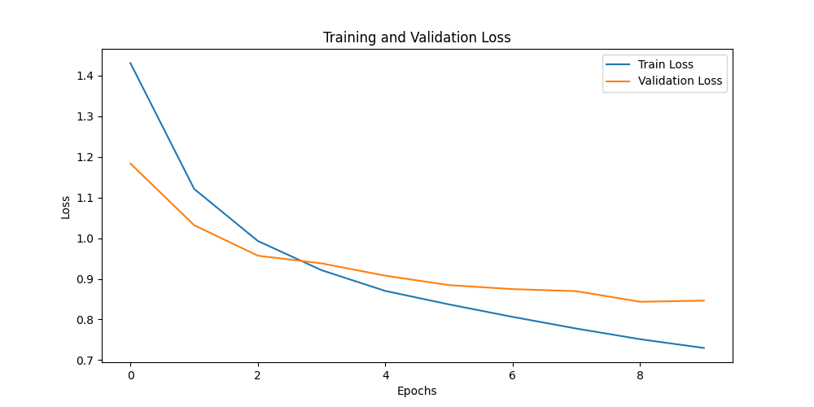
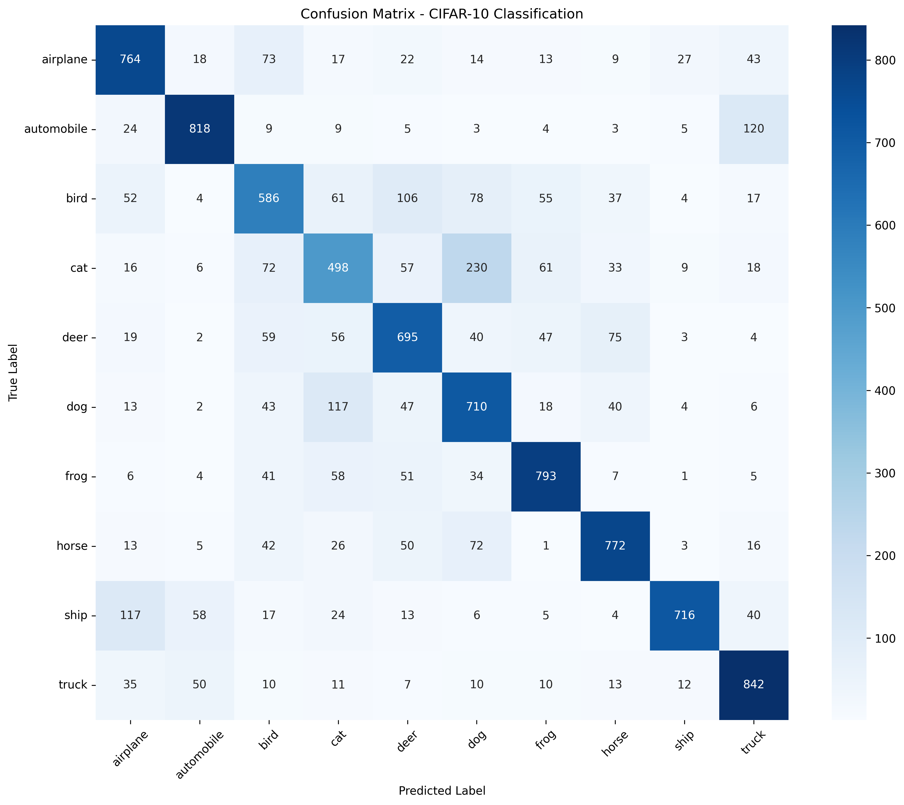

# Exercise 1: Create a Deep Learning Model for image classification in PyTorch with CIFAR-10 dataset

## Objective

El objetivo de esta práctica es entrenar una red neuronal convolucional para clasificar diez clases de imágenes del dataset CIFAR-10 (avión, automóvil, pájaro, gato, venado, perro, rana, caballo, barco, camión).

## Task Formalization

### Task Formalization (Inference)

El problema es de clasificación multiclase: dada una imagen de entrada de 32x32 píxeles con 3 canales de color (RGB), el modelo debe predecir una única etiqueta entre 10 posibles clases. La salida es una distribución de probabilidad sobre las 10 clases.

### Task Formalization (Training)

Durante el entrenamiento, el modelo recibe pares (imagen, etiqueta) y ajusta sus pesos para minimizar la función de pérdida, siendo en este caso la entropía cruzada, debido a que se trata de un problema de clasificación. La etiqueta es un escalar (0-9) que la función CrossEntropyLoss convierte internamente a one-hot encoding.

## Evaluation metrics

Las métricas utilizadas para evaluar el modelo son:

--> Accuracy: Porcentaje de imágenes clasificadas correctamente

--> Matriz de confusión: Visualización de aciertos y errores por clase

--> Loss: Función de pérdida (CrossEntropyLoss) durante entrenamiento y validación

## Data Considerations

### Dataset description

CIFAR-10 contiene 60,000 imágenes en color de 32x32 píxeles, divididas en: 50,000 imágenes de entrenamiento,10,000 imágenes de test y 10 clases equilibradas (6,000 imágenes por clase)

### Data preparation and preprocessing

El preprocesado convierte las imágenes PIL a tensores y normaliza los valores de píxeles. Primero, se escalan los valores del rango original [0, 255] a [0, 1] mediante ToTensor(). Posteriormente, se aplica una normalización estadística usando la media y desviación típica específicas de CIFAR-10 (mean=[0.4914, 0.4822, 0.4465], std=[0.2470, 0.2435, 0.2616]). Esto centra los datos en cero con varianza unitaria, lo que acelera la convergencia y estabiliza el entrenamiento.

### Data augmentation

El aumento de datos aplicado solo durante el entrenamiento incluye:

    Volteo horizontal aleatorio: Refleja la imagen con probabilidad 0.5, aumentando la variabilidad sin perder la identidad semántica

    Recorte aleatorio con padding: Añade 4 píxeles de borde y recorta aleatoriamente una región de 32x32, introduciendo invarianza a pequeñas traslaciones

Estas técnicas reducen el overfitting al exponer al modelo a más variaciones de las imágenes originales, mejorando la generalización sin aumentar el tiempo de inferencia.

## Model Considerations

### Suitable Loss Functions

Para clasificación multiclase, la función de pérdida adecuada es CrossEntropyLoss, que utiliza LogSoftmax.

### Selected Loss Function

Se ha utilizado nn.CrossEntropyLoss() porwue es el estándar multiclase e internamente aplica un softmax (por eso no hay que poner softmax en la última capa del modelo, porque ya lo tiene la función de pérdida).

### Possible architectures

Se experimentó con diferentes arquitecturas:

    2 capas convolucionales: Rápida pero accuracy limitado (~50-60%)

    3 capas convolucionales: Mejor equilibrio velocidad/precisión, la aplicada finalmente

    Redes más profundas: Mayor accuracy pero mucho más lentas. Se ha decidido no seguir por ahí por el coste computacional.

### Last layer activation

No se utiliza activación en la última capa. La función nn.CrossEntropyLoss() ya incluye internamente el softmax, por lo que aplicar softmax antes duplicaría la operación y empeoraría el entrenamiento.

### Other Considerations

Como en un principio el overfitting estaba generando muchos problemas, se ha decidido por usar un dropout para apagar un porcentaje de las neuronas, un 25%, concretamente.
 
 Por otro lado, se ha aumentado el batch-size a 64 para mejorar el equilibrio entre la velocidad y la estabilidad. En un principio ha supuesto ralentizar el entrenamiento, pero los resultados obtenidos eran más óptimos.

Optimizador para la regularización

    Optimizer: AdamW con weight decay para regularización

## Training

### Training hyperparameters

Learning rate = 0.0005

Épocas 7. En un inicio estaba a 12, pero al ver que la red no mejorada se ha decidido parar antes

Optimizador: Adamw

Batch-Size = 64

### Loss function graph

### Discussion of the training process

El entrenamiento mostró una evolución interesante:

    Épocas 1-3: El validation loss baja consistentemente con el train loss, indicando aprendizaje genuino

    Épocas 4-5: Se observa una oscilación en validation loss (sube en época 6, baja drásticamente en época 7)

    Época 7: Se alcanza el mínimo de validation loss (0.8360), superando el mínimo anterior

Esta oscilación es normal cuando el modelo explora el espacio de parámetros cerca del óptimo. El learning rate de 0.0005 permitió estabilidad sin caer en overfitting severo.

Se decidió detener el entrenamiento en época 7 porque:

    El validation loss alcanzó su mínimo

    El tiempo por época (~3 minutos) hacía poco rentable continuar

    La matriz de confusión mostraba resultados aceptables

## Evaluation

### Evaluation metrics

Test Accuracy: 0.7194 (71.94%)

### Evaluation results

Accuracy por clase:

    Automobile: 95% (excelente)

    Truck: 84% (muy bueno)

    Airplane: 76% (bueno)

    Horse: 72% (bueno)

    Dog: 72% (bueno)

    Deer: 67% (aceptable)

    Ship: 65% (aceptable)

    Bird: 59% (mejorable)

    Cat: 57% (mejorable)

    Frog: 51% (mejorable)

### Discussion of the results

¿Cómo resuelve el modelo el problema?

El modelo aprende características jerárquicas: las primeras capas detectan bordes y texturas simples, las capas intermedias combinan estas en formas (ruedas, ojos, orejas), y las capas finales asocian estas formas con clases específicas.

¿Hay overfitting/underfitting?
El modelo muestra un equilibrio saludable:

    Train loss (0.595) y validation loss (0.836) tienen una diferencia razonable

    La validación no empeora progresivamente (síntoma de overfitting)

    En los primeros entrenamientos el overfitting er evidente, ya que el validation loss no bajaba (estancado y oscilando), pero el train loss sí. la matriz de confusión no era del todo mala, pero porque la red se aprendía los resultados. Por ello se ha introducido un de dropout también. 

    El accuracy de 71% es aceptable para una red pequeña

    

¿Cómo mejorar el modelo?

    Aumentar capacidad: Más capas o canales (ej: 64-128-256)

    Regularización adicional: Batch Normalization

    Más épocas con learning rate scheduling. Esto haría que el learning rate no sea estático, poniendo uno más grande al principio y uno más pequeño después para que la rede aprenda mejor de los detalles y pueda mejorar el validation loss.

    Data augmentation más agresiva: Rotaciones, cambios de color...
    
    Lógicamente se ha planteado realizar estas mejoras, pero el coste computacional aumentaba mucho y tardaba demasiado en entrenar.

¿Generalizará bien?

    Con 71% de accuracy, el modelo generaliza razonable-mente bien para tareas similares. Las confusiones principales (gato/perro, automóvil/camión) son lógicas debido a que se confunde con animales peludos, transportes, etc. y reflejan la dificultad inherente del problema. Con las mejoras planteadas la red muy probablemente mostraría una mejora considerable.

## Design Feedback loops

    Iteración	Cambios	            Accuracy	Observación
    1	        LR=0.0001, batch=10	~60%	Muy lento, no converge bien
    2	        LR=0.001, batch=10	62% pero overfitting	Validation loss oscila, train loss baja rápido
    3	        Normalización correcta	65%	Mejora inicial
    4	        + Dropout (0.3)	68%	Reduce overfitting
    5	        + 3ª capa convolucional	71%	Mejor capacidad, estabilidad
    6	        Early stopping en época 7	71%	Optimización temporal

## Questions

### Which are the differences you found between previous model and this one?

La principal diferencia es la arquitectura: el modelo anterior (regresión) usaba capas densas para aproximar funciones continuas, mientras que este modelo usa capas convolucionales para procesar imágenes. Las convolucionales aprovechan la estructura espacial 2D de las imágenes, compartiendo pesos y detectando patrones locales de forma eficiente.

### Does the model generalizes well to new data?

Sí, con 71% de accuracy el modelo generaliza aceptablemente. Las confusiones principales (gato/perro, automóvil/camión) son esperables incluso para humanos en imágenes de baja resolución. Para mejorar generalización se necesitaría una red más profunda y más datos aumentados.

