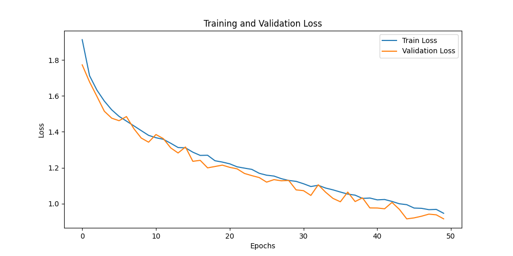
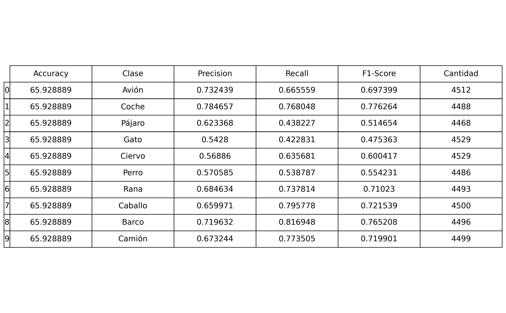
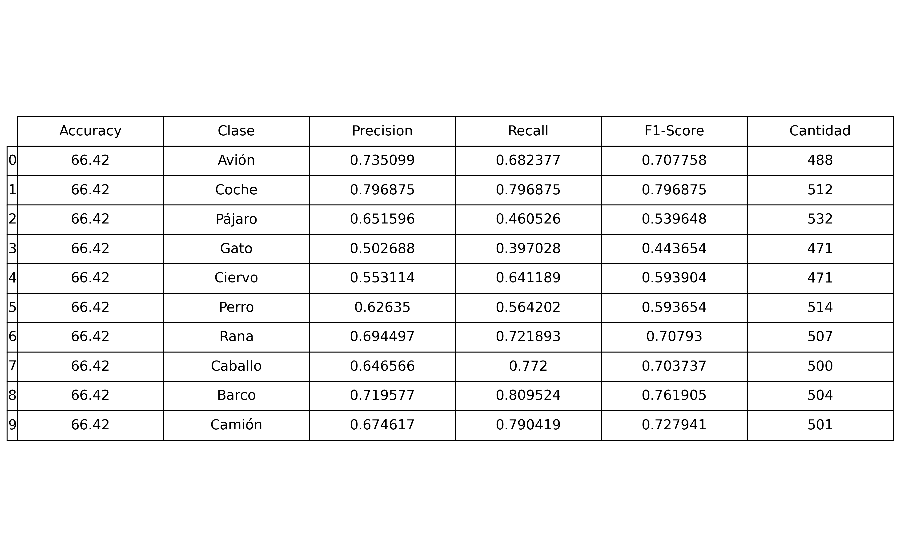
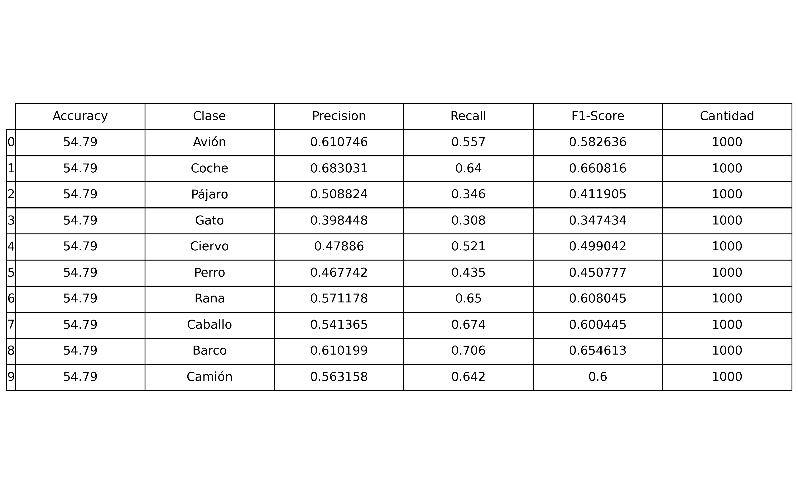
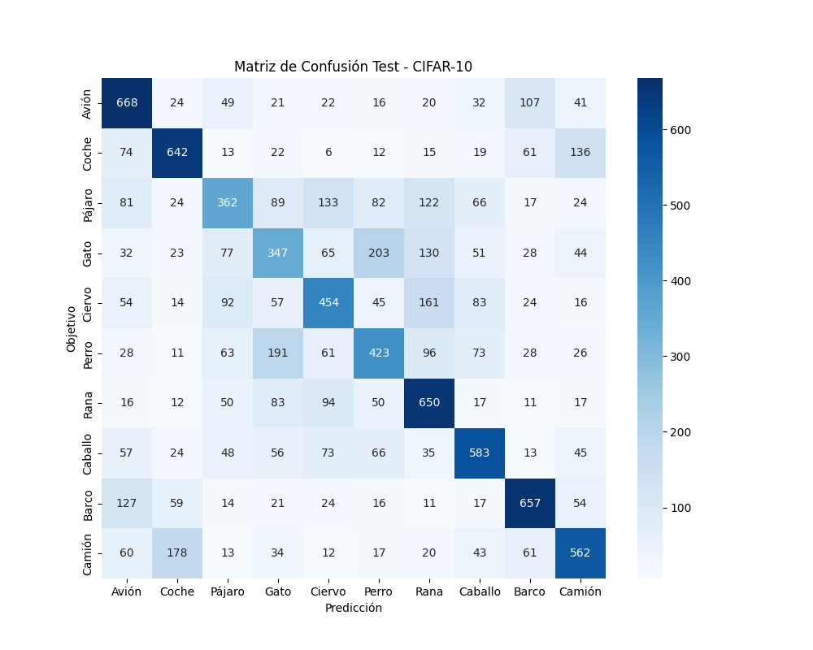
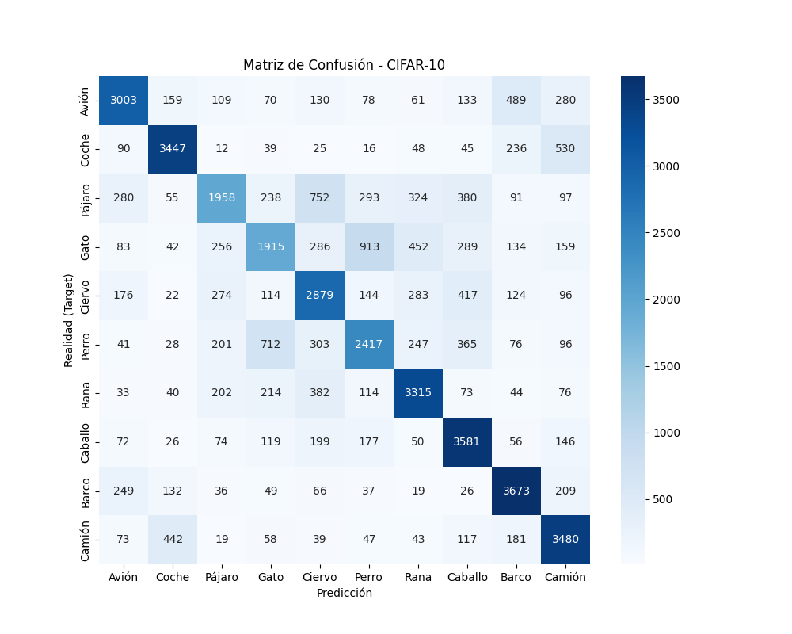
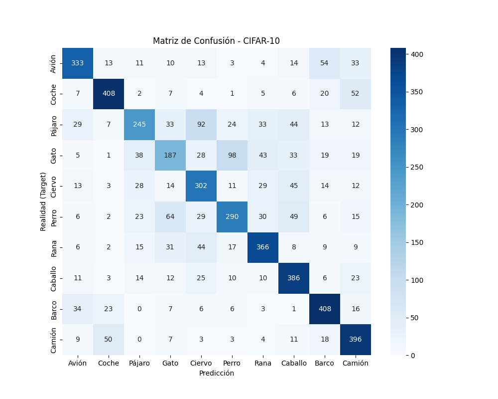
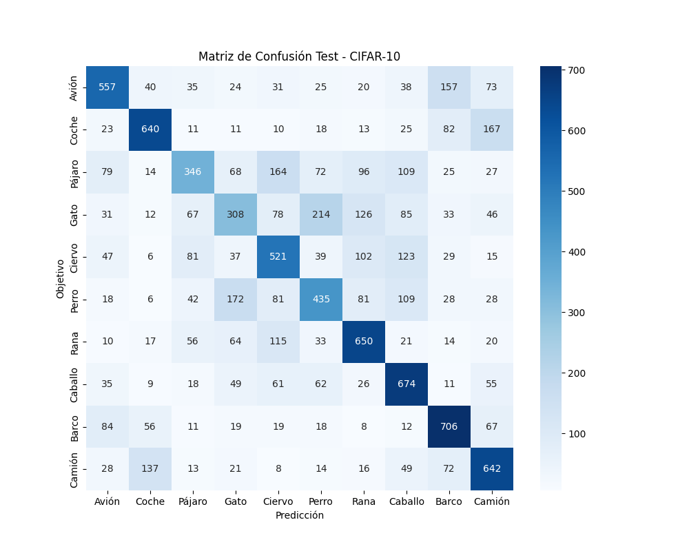

# Exercise 1: Create a Deep Learning Model for image classification in PyTorch with CIFAR-10 dataset

## Objective

Develop a model that can classify images from CIFAR-10 dataset

First try a model only with fully connected layers
Create an evaluate.py file that evaluates the model and calculates and stores the evaluation metrics including a confusion matrix

Which are the conclussions?

## Task Formalization

El objetivo de la práctica es realizar la comparativa entre los resultados obtenidos con una red lineal compuesta por Fully Connected y una red Convolucional. En este ejercicio se aborda el desarrollo y el entrenamiento de la red FC para la solución de un problema de clasificación de imágen multiclase.

### Task Formalization (Inference)

La imagen de entrada tiene un tamaño de 3x32x32, al ser RGB. Como se está trabajando con un conjunto de capas FC, es necesario convertir el tensor en un vector de 3072 elementos. Una vez se tienen los datos listos, se alimenta la red de capas Fully Connected, obteniendo a la salida un vector de dimensión 10. 

### Task Formalization (Training)

El entrenamiento de la red será lento, pues una imagen corresponde a un gran número de datos. Cuanto mayor sea el número de capas, más parámetros y pesos deberán ajustarse y más tiempo de procesamiento requerirá. Con Batch Normalization, es posible acelerar la convergencia y lograr mejores resultados en menor tiempo. Se utilizará una técnica dropout para apagar un número determinado de neuronas aleatorias con el fin de evitar overfitting. Como función de pérdida, al tratarse de un ejercicio de clasificación de imágenes, se recurrirá a Entropía Cruzada.

## Evaluation metrics

Para la evaluación se implementa la generación de una matriz de confusión que permita observar de forma gráfica la capacidad de predicción de la red para los datos de testeo. Además, se calcula la precisión del modelo y el F1 score para cada una de las clases. 

## Data Considerations

### Dataset description

Los datos de entrada corresponden al conjunto de datos CIFAR10, el cual contiene 60.000 imágenes de 10 clases independientes. El propio dataset ya muestra las imágenes destinadas al entrenamiento, la validación y el testeo. 

## Model Considerations

### Selected Loss Function

Como se ha mencionado antes, al tratarse de un problema de clasificación, se recurre a una función de pérdida de entropía cruzada. 

### Possible architectures

Se han supuesto dos arquitecturas diferentes:
    
 - Primer modelo (MLP): Está compuesto por una capa flatten, tres capas fully connected con activación ReLU y una salida Identity

  - Segundo modelo (MLP_2):  Es más complejo que el primero, ya que este dispone de capas de normalización y dropout. Se buscaba obtener un mejor resultado con esta configuración más avanzada. 

## Training

### Training hyperparameters

Los hiperparámetros seleccionados han sido:

- Epochs: 50
- Learning Rate: 0.001
- Batch Size: 256

### Loss function graph

Arquitectura simple:

Arquitectura compleja:

### Discussion of the training process

No se observa overfitting pues la validación sigue decreciendo aunque muestre picos irregulares. El tiempo de entrenamiento de las dos arquitecturas propuestas varía. La compleja requiere casi el doble de tiempo de entrenamiento por época que la segunda debido a su complejidad.

## Evaluation

### Evaluation metrics

En la evaluación se muestran las diferencias de ambos modelos prupuestos:

Las métricas para cada dataset de la arquitectura compleja:

### Evaluation results

Los resultados confirman que una arquitectura más compleja permite obtener mejores resultados a pesar de su lentitud. 

## MLP (simple) Acc = 53.48%
### Test set

## MLP_2 (compleja) Acc = 54.79%

### Train set

### Validation set

### Test set

### Discussion of the results

- How the model solves the problem? El modelo resuelve con menor precisión que CNN debido a las limitaciones de las FC y la potencia de las CNN.

- Is there overfitting, underfitting or any other issues? No se han encontrado rastos de overfitting.

- How can we improve the model? Trabajando con una CNN

- How this model will generalize to new data? Al tratarse de un modelo basado en FC, malamente, pues depende mucho de las similitudes entre las entradas y las mínimas diferencias pueden provocar error en las predicciones.

## Design Feedback loops

Capa Flattening para obtener un vector simple, conjunto capas FC, Batch Normalization y ReLU, con alguna capa Dropout para eliminr overfitting. 

